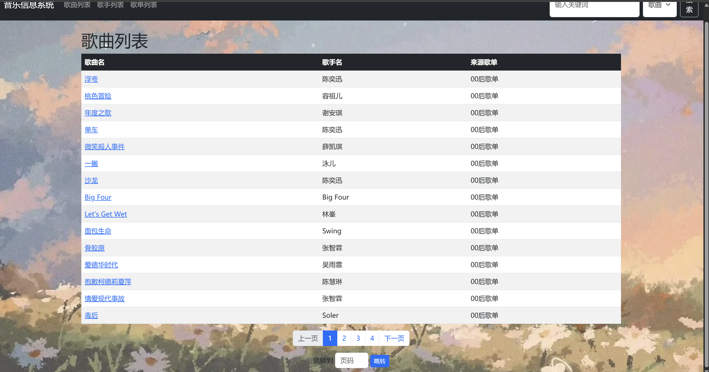
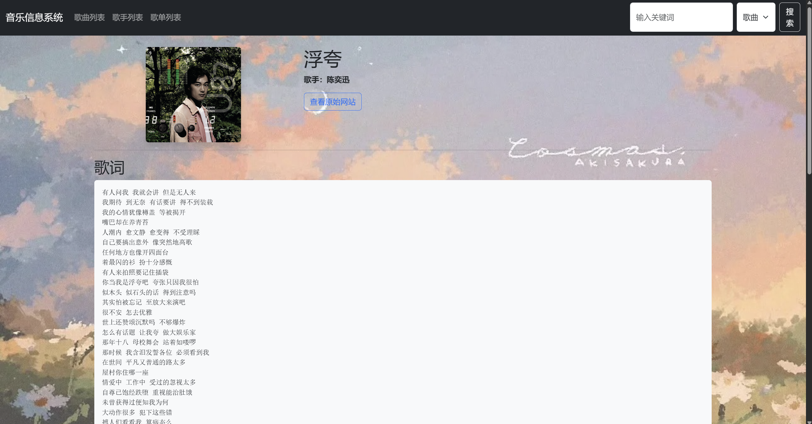
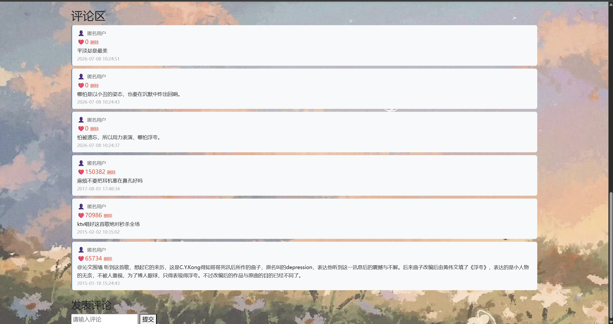
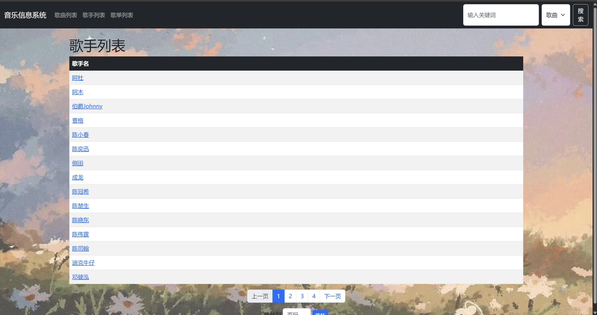
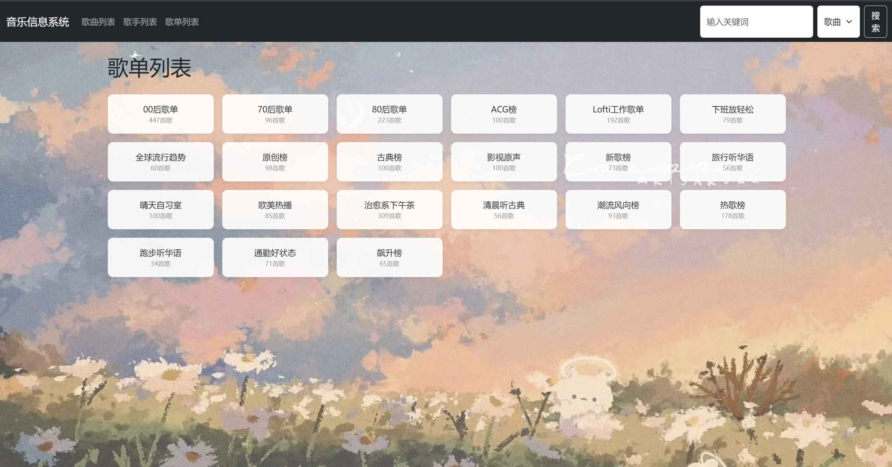
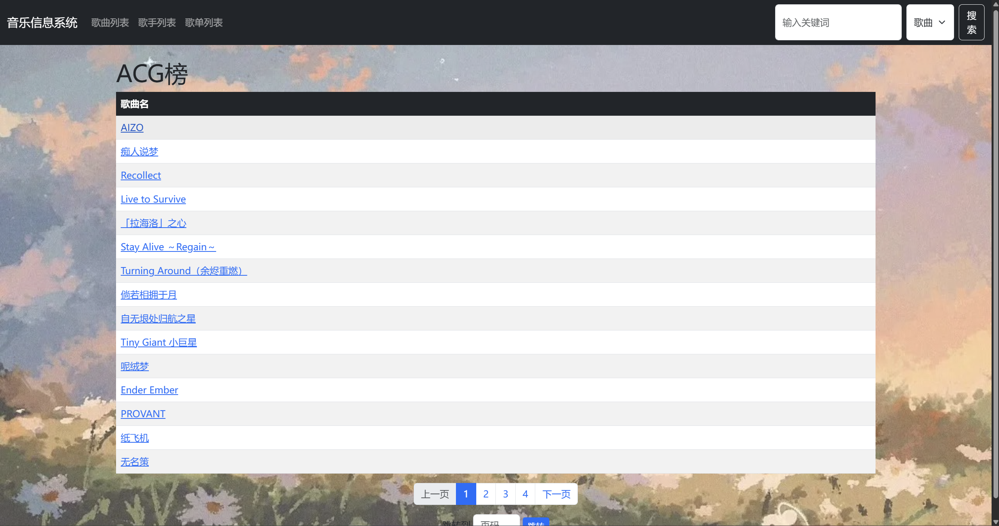

# 音乐信息系统实验报告
## 一、实验概述
### 本次实验通过爬虫技术爬取网易云音乐的歌单、歌曲、歌词、歌手及评论数据，使用 Django 框架构建 Web 系统进行数据展示与检索，并对爬取的数据进行分析，得出三个有价值的结论。
## 二、系统功能展示
### 2.1 歌曲列表主页
#### `功能说明`：`系统主页，分页展示所有歌曲，每页显示 20 首。支持点击歌名跳转歌曲详情页。`
#### `功能展示`：

### 2.2 歌曲详情页
#### `功能说明`：`展示歌曲的完整信息（歌名、歌手、封面图、歌词、原始网站链接），底部有评论功能，支持发表和删除评论，评论按时间倒序排列。`
#### `功能展示`：

#### `说明`：评论区导入了原有网站中点赞数目最多的几条评论，如下图所示，前几条最新的评论由我测试手动导入

### 2.3 歌手列表页
#### `功能说明`：分页展示所有歌手，点击歌手名跳转歌手详情页。
#### `功能展示`：

### 2.4 歌手列表页
#### `功能说明`：展示歌手信息（名、图片、简介、原始网站链接），以及该歌手在本系统中的所有歌曲列表，点击歌曲可跳转歌曲详情页。
#### `功能展示`：

### 2.5 搜索功能
#### `功能说明`：在页面顶部搜索栏输入关键词，选择搜索类型（歌曲/歌手），跳转到搜索结果页。结果显示匹配数量及搜索耗时（毫秒），支持分页。
#### `功能展示`：
`说明`：示例搜索了`keyword“我”`，得到结果如下

### 2.6 歌单列表页（我自己根据实际情况添加的界面，点击进去可以看到实际的歌单详情）
#### `功能说明`：展示歌手信息（名、图片、简介、原始网站链接），以及该歌手在本系统中的所有歌曲列表，点击歌曲可跳转歌曲详情页。
#### `功能展示`：

#### 歌单详情如下展示：

## 三、数据量统计

用表格列出爬取的数据量：

| 数据类型 | 数量          |
| ---- | ----------- |
| 歌曲总数 | `2615` 首      |
| 歌手总数 | `710` 位      |
| 歌单数量 | `21` 个        |
| 歌词   | `2615`首（含歌词） |
| 评论   | 每首歌 `3` 条     |
## 四、主要功能说明
### 4.1 爬虫板块

**目标网站：** 网易云音乐

**数据源：** 21 个不同主题的歌单（热歌榜、新歌榜、70 后歌单、80 后歌单等）

### 爬取流程

1. 请求歌单 API 获取歌曲列表
1. 根据歌曲 ID 请求歌词 API
2. 根据歌手 ID 请求歌手详情页
3. 根据歌曲 ID 请求评论 API

### 反爬策略

* 添加 Referer 和 User-Agent 请求头
* 使用 `MUSIC_U` Cookie 模拟登录态
* 请求间隔 `time.sleep(0.5)` 避免被限流

### 数据清洗

* 歌词去除时间轴标签（正则表达式 `\[\d{2}:\d{2}\.\d{2,3}\]`）  `get_lyrics.py`
* 歌词去除作词 / 作曲等元信息行  `get_lyrics.py`
* 歌词去除空行 `get_lyrics.py` 
* 歌手数据按 `artist_id` 去重 `deduplicated_artists.py`

---

## 4.2 Web 系统模块

**框架：** `Django 4.2`

**数据来源：** 
| 文件                        | 内容                               |
| ------------------------- | -------------------------------- |
|`songs_with_lyrics_all.csv` | 歌曲数据（歌名、歌手名、歌手 ID、专辑封面、歌词、来源歌单）  |
| `artists_unique.csv`        | 歌手数据（歌手名、歌手 ID、歌手图片、歌手简介、歌手 URL） |
| `comments.json`             | 评论数据（用户提交的评论，持久化存储）              |

#### 核心功能

* 分页展示（Django `Paginator`，每页 20 条）
* 搜索（子串匹配，并记录查询耗时）
* 评论（使用 JSON 文件进行持久化存储）

#### 说明：模板继承
##### 所有的界面`html`均继承自`base.html`,保持导航栏目和搜索栏目的框架一致。

#### 界面美化
* 加了 `Bootstrap` 框架
* 表格加了边框和隔行变色
* 导航栏加了背景色
* 页面加了居中容器
* 导入了背景图片
* 分页按钮加了样式
* 歌单页面加入了`CSS`渲染
## 五、核心算法
* 爬虫模块：使用 `requests` 库发送 `HTTP` 请求，通过 `BeautifulSoup` 解析 HTML 页面提取歌手信息，使用`正则表达式`清洗歌词文本。
* 本实验涉及算法的部分有`搜索`时使用的**倒排索引**与**子串匹配**，将词语对歌曲或歌手的映射建立起来，时间复杂度为`O(1)`。
* 数据分析模块：使用 `SnowNLP` 进行情感分析，`WordCloud` 生成词云，`matplotlib` 绘制统计图表。
## 六、时间分配
### 1. 爬虫（2天）
### 2. WEB （2天）
### 3. 界面美化 （2天）
### 4. 数据分析 （2天）
## 七、实验感想
* 我认为对我的难点主要涉及到**爬虫数据采集**和**前端网页编写**上，前者网易云有一些界面是通过`JS`动态加载的，所以并不方便直接爬取，所以爬虫时我采取了双重保险（BeautifulSoup保底+api访问）的方式。
* 前端网页语法书写不是很熟悉，所以学习起来花了挺多时间的。